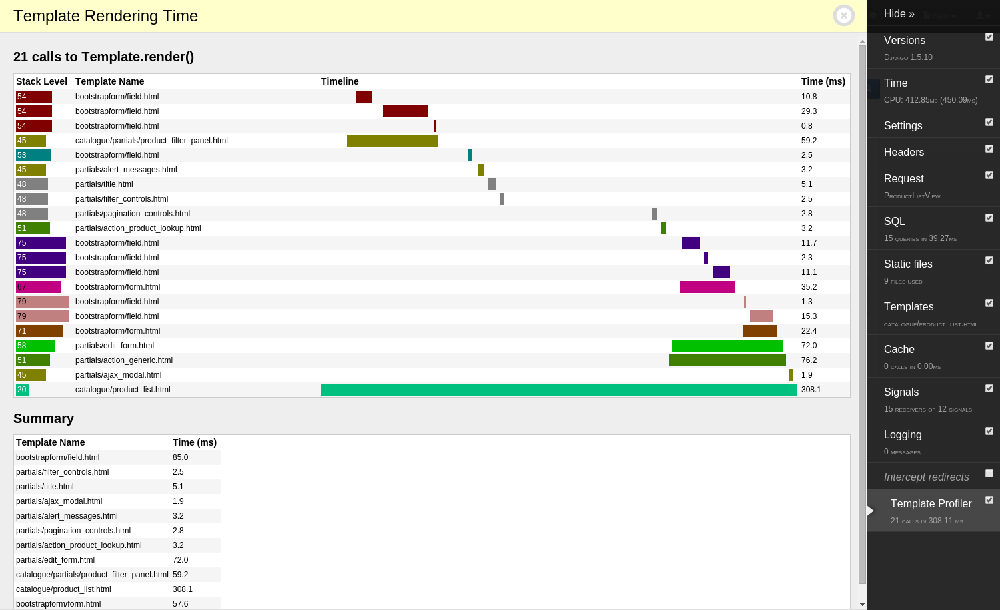

Django Debug Toolbar Template Profiler
======================================

This panel displays time spent rendering each template and
graphical respresentation on the timeline (see screenshot)

Install
=======

- pip install django-debug-toolbar-template-profiler

- Add 'template_profiler_panel.panels.template.TemplateProfilerPanel' to
  DEBUG_TOOLBAR_PANELS in your settings.py (.. _see how: http://django-debug-toolbar.readthedocs.org/en/latest/configuration.html#debug-toolbar-panels)

- Add 'template_profiler_panel' to INSTALLED_APPS

Screenshot
==========

